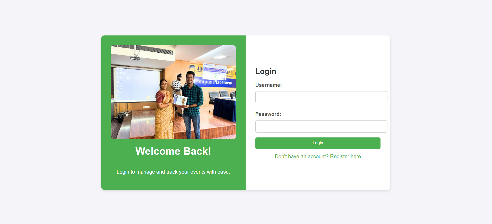
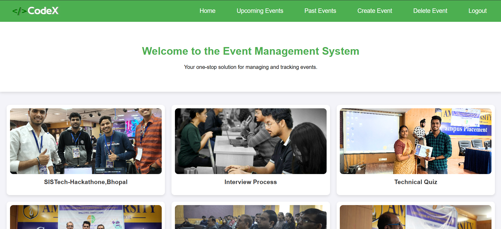
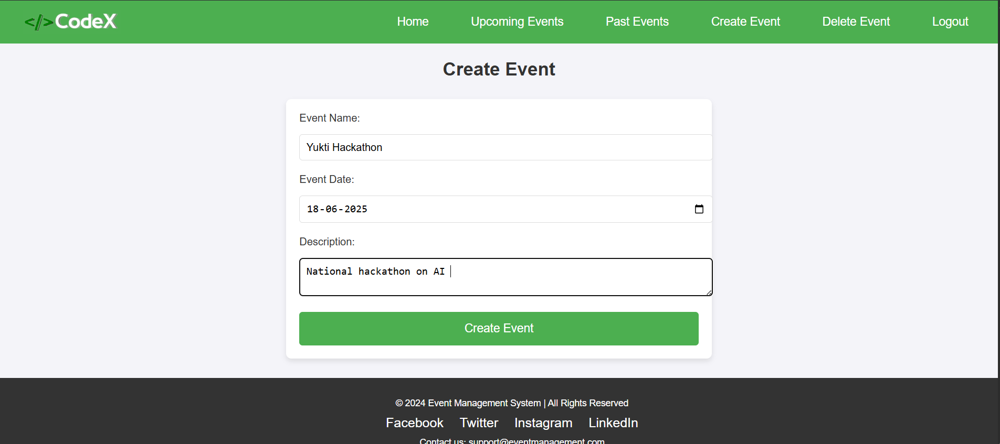
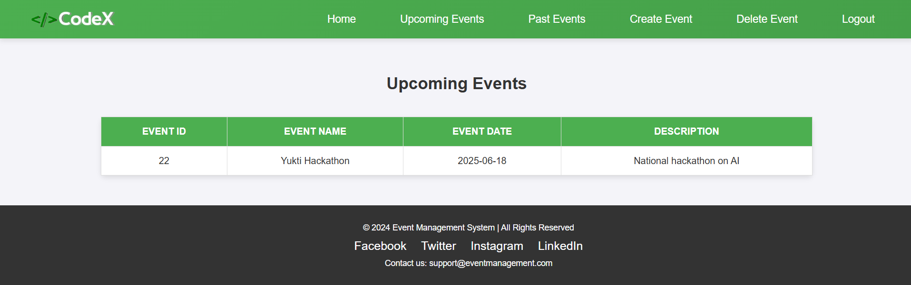
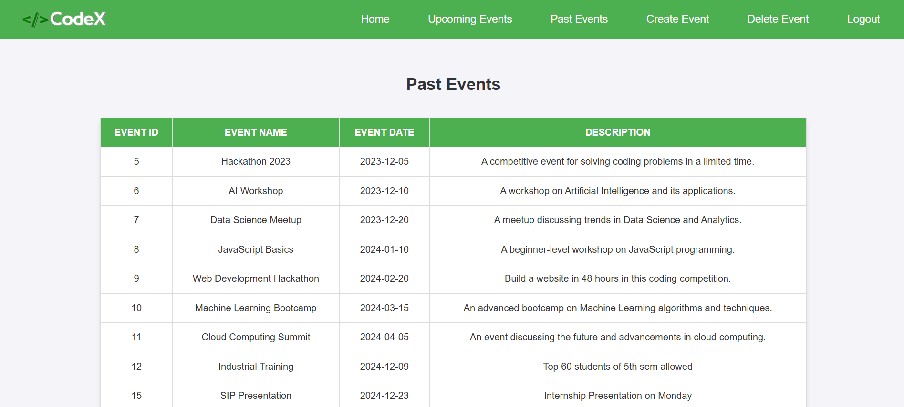
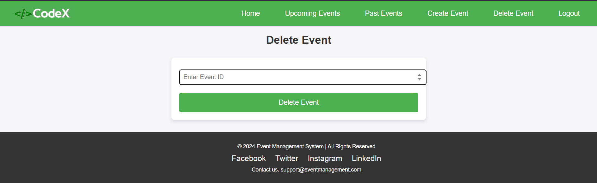

# 📅 Event Management System

An intuitive Java-based web application that allows users to register, log in, and manage events in a streamlined way. Built using **Java Servlets**, **JSP**, and **MySQL**, this system simplifies the process of creating, viewing, and deleting events in a collaborative environment.

---

## 🔍 Overview

This project provides a basic yet functional platform for managing events. Users can create their own events, view upcoming and past events, and maintain their session through secure login and logout functionality.

---

## ✨ Features

- 🔐 User registration and login  
- ➕ Event creation with event name, date, and description  
- 📅 View **upcoming** and **past** events  
- ❌ Delete events  
- ✅ Confirmation messages on success/error actions  
- 📂 Session-based access control for event operations

---

## 🧱 Tech Stack

| Layer     | Technology         |
|-----------|--------------------|
| Frontend  | HTML, CSS, JSP     |
| Backend   | Java Servlets      |
| Database  | MySQL              |
| Server    | Apache Tomcat 10   |


---

## ⚙️ Getting Started

### 1. Clone the Repository
```bash
git clone https://github.com/praveenkumarrawat/Event-Management-System.git
````

### 2. Set Up the Database

* Use the provided SQL file: `src/main/webapp/database_schema.txt`
* Create a MySQL database and import the schema.

### 3. Configure Database Credentials

Open `DBConnection.java` and update:

```java
String url = "jdbc:mysql://localhost:3306/YOUR_DB_NAME";
String username = "YOUR_DB_USERNAME";
String password = "YOUR_DB_PASSWORD";
```

### 4. Run the Application

* Import the project into **Eclipse** or **IntelliJ** as a Dynamic Web Project.
* Add **Apache Tomcat 10** as the runtime.
* Clean, build, and deploy the project.

---

## 📸 Screenshots

> 📁 Place your screenshots in a `screenshots/` folder in your repository and update these paths.

### 🔐 Login Page



### 📝 Register Page


### 📝 Home Page



### 🎉 Create Event



### 📅 Upcoming Events



### 📅 Past Events




### 🎉 Delete Event



---


## 👤 Author

**Praveen Kumar Rawat**
📌 [GitHub Profile](https://github.com/praveenkumarrawat)


